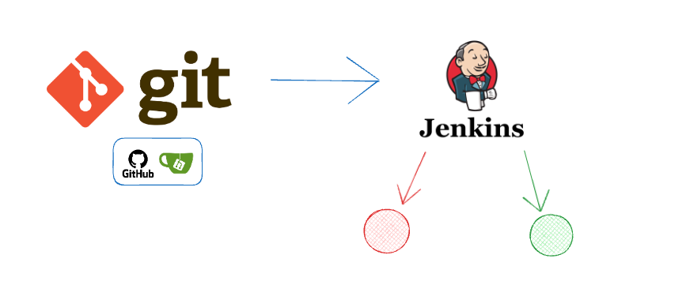

# jenkins-demo



A small Express API with a Jenkins pipeline that tests, builds, deploys, and
load-tests it, and rolls back automatically if something fails. The code lives on
a public GitHub repo. Jenkins runs on your own machine and polls GitHub for new
commits.

This README covers setup. For how it works and the theory behind it (what Jenkins
is, the pipeline stages, the job as code, and triggering), see [theory.md](theory.md).

## Layout

```
http-api/         the app and its pipeline
  app.js          one /health route
  test/           the test for that route
  Dockerfile      multi-stage build (test stage + runtime stage)
  docker-compose.yml   runs the app (project "http-api", port 8091)
  loadtest.js     k6 load test with pass/fail thresholds
  Jenkinsfile     the pipeline

jenkins-server/   the Jenkins server (Docker)
  Dockerfile      Jenkins + Docker CLI + JCasC and Job DSL plugins
  docker-compose.yml   runs Jenkins on port 8090
  jenkins.yaml    creates the jenkins-demo job on startup (JCasC)
```

Ports are 8090 for the Jenkins UI and 8091 for the app, to avoid clashing with
other things on the machine.

## Run it

1. Push this folder to a public GitHub repo named `jenkins-demo`:

   ```bash
   git init && git add . && git commit -m "init"
   git branch -M main
   git remote add origin https://github.com/godinhojoao/jenkins-demo.git
   git push -u origin main
   ```

   If your username differs, update the `url(...)` in `jenkins-server/jenkins.yaml`.

2. Start Jenkins on your machine:

   ```bash
   cd jenkins-server
   docker compose up -d --build
   docker compose logs jenkins
   ```

   Open http://server.local:8090, unlock it with the password from the logs,
   install the suggested plugins, and create a user. Jenkins creates the
   `jenkins-demo` job by itself from `jenkins.yaml`.

3. Push a commit. Jenkins polls GitHub every minute and runs the pipeline. When it
   passes, the app is at http://server.local:8091/health.

## GitHub access

A public repo needs no credentials, so there are no secrets in this project.
You'd only need a token if you make the repo private. In that case create a
GitHub personal access token (Settings, Developer settings, fine-grained tokens)
with read access to the repo, add it in Jenkins under Credentials as a
username/token pair, and reference it in the job's Git settings. Use a token, not
your password, since GitHub no longer accepts passwords over HTTPS.

## Updating

If you change `jenkins-server/jenkins.yaml` (the job config), restart Jenkins so
it reloads:

```bash
cd jenkins-server
docker compose restart jenkins
```

If you change `http-api/Jenkinsfile` (the pipeline), you don't restart anything.
Just commit and push. Jenkins pulls the latest Jenkinsfile from GitHub on the
next build.

## Reset

Run inside `jenkins-server/` or `http-api/` to remove containers, volumes, and
images (this deletes data):

```bash
docker compose down -v --rmi all --remove-orphans
```
