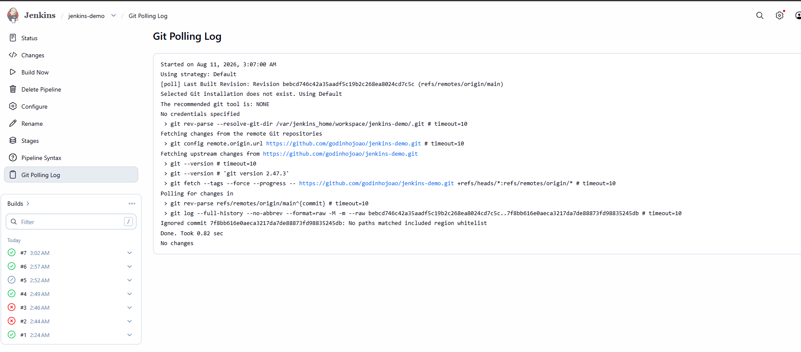

# Jenkins CI/CD from scratch: test, build, deploy, and roll back

## Overview

Shipping code by hand is slow and easy to get wrong: run the tests, build the
image, copy it to the server, restart, check it still works. CI/CD automates all
of that. You push code, and a pipeline runs those steps for you, every time, the
same way.

This article explains the basics of Jenkins and walks through a small, real
pipeline that tests, builds, deploys, and load-tests an API, and rolls back on
its own if something breaks. The full code is here:

- Repository: https://github.com/godinhojoao/jenkins-demo

I run this on a homelab: a Raspberry Pi with [Gitea](https://about.gitea.com/)
(a self-hosted Git server) next to [Jenkins](https://www.jenkins.io/). The public repo above uses GitHub so
anyone can reproduce it.

## What is Jenkins?

Jenkins is an open-source automation server for CI/CD (Continuous Integration and
Continuous Delivery). Instead of running build and deploy commands by hand, you
describe them once and Jenkins runs them on every push.

A few terms worth knowing:

- **Controller**: the main Jenkins process. Hosts the web UI, stores jobs and
  config, and schedules work.
- **Agent (node)**: a worker that actually runs the build steps. With one
  machine, the controller also runs the builds (`agent any`).
- **Pipeline**: a job whose steps are code, split into **stages** (Test, Build,
  Deploy, ...).
- **Jenkinsfile**: the file that defines the pipeline, committed next to the app.
- **Trigger**: what starts a build automatically (a webhook, or polling the repo).

## The pipeline

The pipeline in this repo has five stages, and rolls back if anything fails after
a deploy:

```
Test    -> npm test inside a Docker build (broken code never ships)
Build   -> docker build, image tagged by commit
Deploy  -> docker compose up -d
Verify  -> hit /health until it responds
Load    -> k6 sends traffic and checks latency/error thresholds
```

If **Test** or **Build** fails, the pipeline stops and nothing is deployed. If
**Verify** or **Load test** fails, the new version was already deployed, so a
`post { failure }` block redeploys the last good image automatically.

Here is the whole thing as code (`http-api/Jenkinsfile`):

```groovy
pipeline {
  agent any

  environment {
    IMAGE = 'http-api'
    TAG   = "${env.GIT_COMMIT?.take(7) ?: 'dev'}"    // tag image by commit
    STATE = "${JENKINS_HOME}/http-api.last_good"      // remembers last good tag
  }

  stages {
    stage('Test') {
      // runs the tests inside the Docker build; fails the run if a test fails
      steps { dir('http-api') { sh 'docker build --target test -t $IMAGE:test .' } }
    }
    stage('Build') {
      steps { dir('http-api') { sh 'docker build --target runtime -t $IMAGE:$TAG .' } }
    }
    stage('Deploy') {
      steps { dir('http-api') { sh 'IMAGE_TAG=$TAG docker compose up -d' } }
    }
    stage('Verify') {
      // is the app up? fail fast before wasting time on the load test
      steps {
        dir('http-api') {
          sh '''
            for n in $(seq 1 10); do
              if docker compose exec -T app wget -qO- http://localhost:3000/health >/dev/null 2>&1; then
                echo healthy; exit 0
              fi
              sleep 2
            done
            echo "health check failed"; exit 1
          '''
        }
      }
    }
    stage('Load test') {
      // k6 checks latency/error thresholds; a breach fails the stage
      steps {
        dir('http-api') {
          sh '''
            docker run --rm -i --network host \
              -e BASE_URL=http://localhost:8091 \
              grafana/k6 run - < loadtest.js
            echo $TAG > "$STATE"      # only now is this tag the rollback target
          '''
        }
      }
    }
  }

  post {
    failure {
      // auto-rollback: redeploy the last version that passed the load test
      dir('http-api') {
        sh '''
          if [ -f "$STATE" ]; then
            PREV=$(cat "$STATE")
            echo "rolling back to $PREV"
            IMAGE_TAG=$PREV docker compose up -d
          fi
        '''
      }
    }
  }
}
```

This is a *recreate* (big bang) deployment: one container is stopped and a new one
started, so there is a short downtime window during the swap. Strategies like
blue/green or canary remove that gap, but recreate is simple and fine for a
homelab.

## The job as code (JCasC)

You can create a Jenkins job by clicking through the UI, but this repo defines it
as code with the **Configuration as Code (JCasC)** and **Job DSL** plugins. When
the Jenkins container starts, it reads `jenkins-server/jenkins.yaml` and creates
the job by itself: the repo URL, the branch, where the Jenkinsfile lives, how
often to poll, and which paths should trigger a build.

```yaml
pipelineJob('jenkins-demo') {
  definition {
    cpsScm {
      scm {
        git {
          remote { url('https://github.com/godinhojoao/jenkins-demo.git') }
          branch('*/main')
          extensions {
            // only build when files under http-api/ change
            pathRestriction { includedRegions('http-api/.*') }
          }
        }
      }
      scriptPath('http-api/Jenkinsfile')
    }
  }
  triggers { scm('* * * * *') }   // poll every minute
}
```

The benefit: the whole setup is reproducible. Rebuild the machine and the job
comes back exactly the same, no manual clicking.

## Build agents

In this homelab I don't use agents: the same Jenkins container runs the UI and
the builds (`agent any`). It is simple and fine for one machine and my own code.
In a real setup, though, running builds on separate agents is recommended. The
main gains are:

- Isolation (security): builds run away from the controller, so they can't reach
  its config and credentials. Important for untrusted code, like public pull requests.
- Scale: spread many builds across machines and run them in parallel.
- Clean environments: a fresh, disposable container per build.
- Different platforms: build on another OS or CPU architecture.

## Setup in short

```bash
# 1. push the project to a public GitHub repo
git init && git add . && git commit -m "init"
git remote add origin https://github.com/<you>/jenkins-demo.git
git push -u origin main

# 2. start Jenkins
cd jenkins-server
docker compose up -d --build
docker compose logs jenkins        # copy the first-run admin password
```

Open the Jenkins UI, unlock it, install the suggested plugins, and create a user.
The job is created automatically from `jenkins.yaml`. From then on, a push runs
the pipeline.

## What it looks like

A successful run: every stage passes and the app is deployed.


A failing test stops the pipeline, so nothing is deployed.


The app deployed but failed the load test, so it rolled back to the last good
image.


A change outside `http-api/` (like editing the README) is ignored by polling, so
no build runs.



## Running it on your own homelab

I run this on a Raspberry Pi with Gitea and Jenkins side by side. That keeps my
code and my pipelines fully under my control, with no dependency on any cloud.

In this public demo the job polls GitHub, because GitHub can't reach a machine on
a home network. On my own homelab I don't poll: since Gitea is local, it can
reach Jenkins directly, so a Gitea webhook triggers builds instantly on every
push. In production, with a public IP, a VPS, or a configured tunnel, you could
use GitHub webhooks the same way.

If you have a homelab, I recommend the same: self-host Gitea, connect it to
Jenkins with a webhook, and everything runs on hardware you own. That is the whole
point of a homelab, keeping your code and pipeline private and in your hands.

The full working example, all the configs, and a step-by-step setup are in the
repository: https://github.com/godinhojoao/jenkins-demo

## References

- [Jenkins Pipeline](https://www.jenkins.io/doc/book/pipeline/)
- [Jenkins Configuration as Code (JCasC)](https://www.jenkins.io/projects/jcasc/)
- [Job DSL plugin](https://plugins.jenkins.io/job-dsl/)
- [Gitea](https://about.gitea.com/)
- [k6 load testing](https://grafana.com/docs/k6/latest/)
